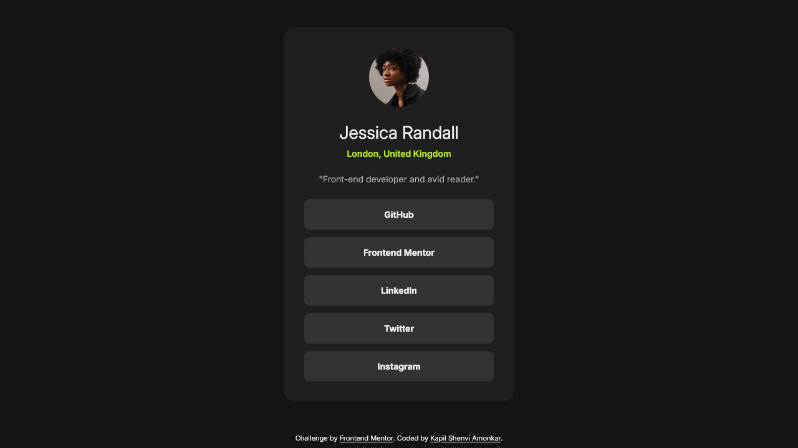
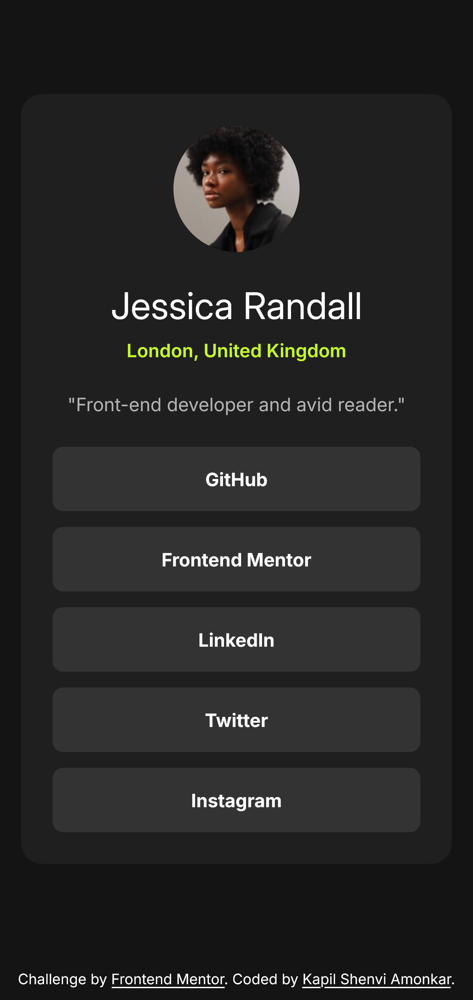
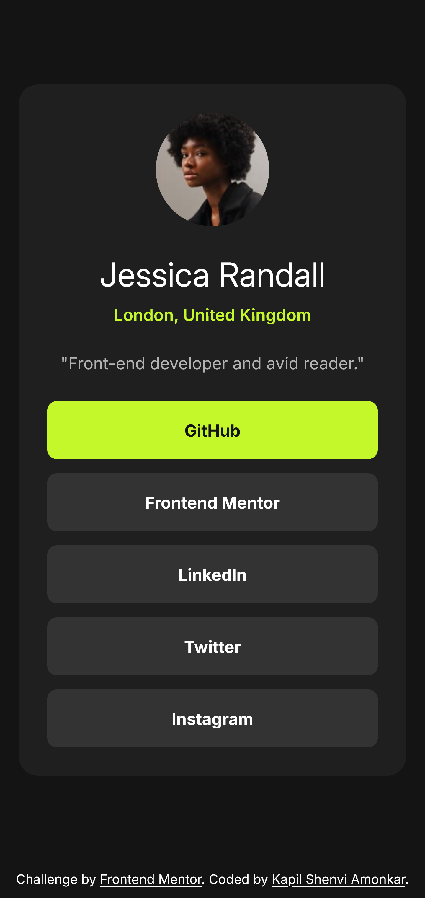

# Frontend Mentor - Social links profile solution

This is a solution to the [Social links profile challenge on Frontend Mentor](https://www.frontendmentor.io/challenges/social-links-profile-UG32l9m6dQ). Frontend Mentor challenges help you improve your coding skills by building realistic projects. 

## Table of contents

- [Overview](#overview)
  - [Screenshot](#screenshot)
  - [Links](#links)
- [My process](#my-process)
  - [Built with](#built-with)
  - [What I learned](#what-i-learned)
  - [My favourite code](#my-favourite-code)
  - [Useful resources](#useful-resources)
- [Author](#author)


## Overview

### Screenshot


<div style="display: flex; justify-content: center; gap: 2rem;">
  
  
</div>


### Links

- Solution URL: [Social Links Profile Solution](https://github.com/kapil-2695/fmc-social-links-profile)
- Live Site URL: [Live site - Social Links Profile](https://kapil-2695.github.io/fmc-social-links-profile)


## My process
  
### Built with

- Semantic HTML5 markup
- CSS custom properties
- CSS Grid
- CSS `calc()` function
- CSS transition property


### What I learned

- I learned to make the widths of a box more responsive using `max-width` and dynamic `width`. 
- I learned to make use of `calc()` to dynamically set the width by subtracting margin value on either side.
- I learned to use transition property on button for `not active` → `active` state.


### My favourite code

```css
.social-card {
  /* keeps the card centered from all sides. */
    place-self: center;  

    display: grid;
    gap: var(--spacing-200);
    background-color: var(--clr-gray-800);
    
    /* margin value is respected when screen size goes below min-width */
    margin: var(--spacing-100);
    /* limit max width on large screens */
    max-width: 368px; 
    /* subtract margin value from dynamic width */
    width: calc(100% - var(--spacing-100) * 2); 
    /* min-width avoids overflow of content within the card */
    /* min-content adjusts card width by sqeezing content as much as possible */
    min-width: min-content;

    text-align: center;
    color: var(--clr-white);
    border-radius: 1rem;
    font-size: var(--fs-400);
    padding: var(--spacing-400);
}
```


### Useful resources

- [Learn CSS - web.dev](https://web.dev/learn/css/) - This helped me with CSS code.


## Author

- Frontend Mentor - [@kapil-2695](https://www.frontendmentor.io/profile/kapil-2695)
